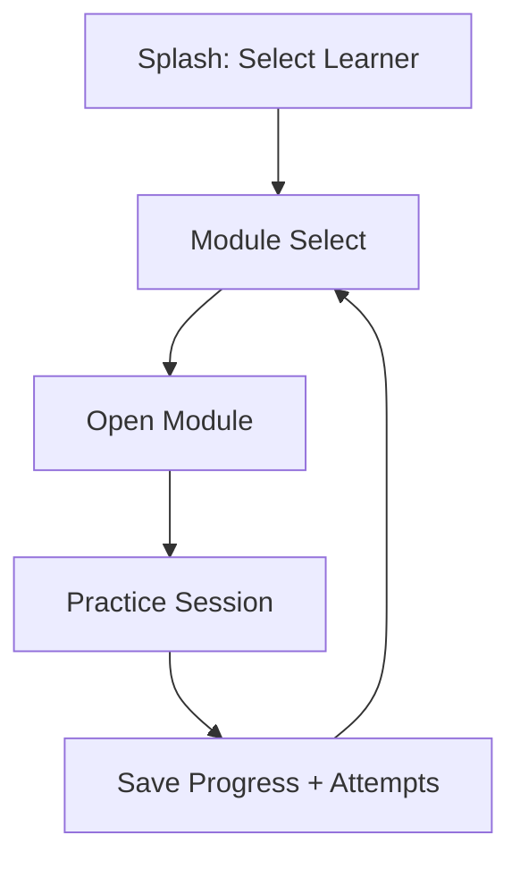
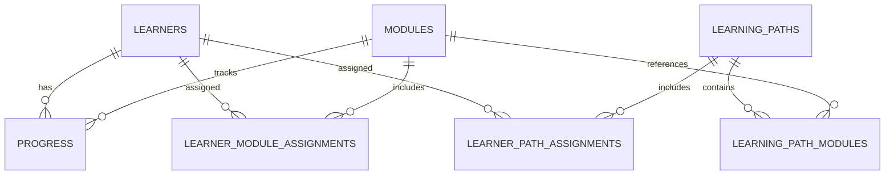

# BrightSteps Roadmap and Flows

This document distills the architecture direction into a practical rollout plan, with concrete module examples and product/data-flow diagrams.

## Current baseline (already in place)

- Learner-first entry (`SplashScreen`)
- Module picker after learner select (`ModuleSelect`)
- Sight Words as first/default module (`src/modules/index.js`)
- Progress isolated by `learnerId + moduleId + itemIndex`
- Active module persisted per learner via `activeModuleId:<learnerId>`

---

## Phase roadmap

## Phase 0 — Baseline stabilization

**Goal:** keep the new learner → module flow stable.

- [x] Learner selects account first
- [x] Learner opens module from module picker
- [x] Sight Words remains first/default
- [x] Progress stays isolated per learner/module

**Exit criteria**

- `npm run check`, `npm run lint`, `npm run build` pass
- No regression in splash, parent setup, and practice flow

## Phase 1 — Module system hardening

**Goal:** make modules self-contained and easy to add.

- [ ] Expand module contract in `src/modules/index.js`
- [ ] Move Sight Words module-specific practice UI into `src/modules/sightWords/`
- [ ] Keep shared storage/session behaviors in app shell and storage layer

**Exit criteria**

- Sight Words runs through module contract (no special-case hacks)
- A second module can be added with minimal boilerplate

## Phase 2 — Parent + learner domain model

**Goal:** support parent-managed setup without cloud auth.

- [ ] Add local parent profile concept
- [ ] Keep learner profiles nested under device/parent context
- [ ] Preserve existing learner IDs/progress compatibility

**Exit criteria**

- Parent flow stays simple and kid-safe
- Existing saved data remains readable

## Phase 3 — Assignment engine (modules + paths)

**Goal:** parents can assign modules or full learning paths.

- [ ] Add storage entities:
  - `learning_paths`
  - `learning_path_modules` (ordered)
  - `learner_module_assignments`
  - `learner_path_assignments`
- [ ] Add resolver API:
  - `getLearnerPracticeQueue(learnerId)`
  - dedupe modules and keep deterministic order

**Exit criteria**

- Assign/unassign modules and paths
- Learner sees assigned content only

## Phase 4 — Parent dashboard UX

**Goal:** ship complete assignment workflow.

- [ ] Parent dashboard with learner switcher
- [ ] Learner assignment panel
- [ ] Path builder (create/edit/reorder)
- [ ] Empty-state guidance for learners with no assignments

**Exit criteria**

- Parent can complete full assignment workflow from UI
- Mobile layout and accessibility remain strong

## Phase 5 — Progress and reporting

**Goal:** better assignment decisions for parents.

- [ ] Per-learner, per-module progress cards
- [ ] Path-level completion summaries
- [ ] Optional attempts-based trend summaries

**Exit criteria**

- Parent can quickly decide what to assign next
- Progress model keying remains unchanged

## Phase 6 — Quality and release hardening

**Goal:** safe iteration as module count grows.

- [ ] Tests for assignment resolver and module registry validation
- [ ] Feature flag for assignment system rollout
- [ ] Rollback plan: hide assignment UI while keeping data intact
- [ ] Run Tauri debug build after schema/permissions updates

**Exit criteria**

- `format/check/lint/build` green
- `npm run tauri -- build --debug` passes for desktop-impacting changes

---

## Recommended implementation order

1. Phase 1 (module hardening)
2. Phase 3 (assignment engine backend)
3. Phase 4 (parent assignment UI)
4. Phase 5 (reporting)
5. Phase 2 and Phase 6 continuously as needed

---

## Example module catalog (v1)

### 1) Sight Words

- Skill: high-frequency word recognition
- Modes: flash, listen, type
- Existing source: `src/data/fryWords.js`

### 2) Letter Sounds

- Skill: letter/digraph ↔ sound mapping
- Suggested modes: hear sound → choose grapheme; see grapheme → pick sound

### 3) CVC Word Builder

- Skill: blending short vowel CVC words
- Suggested modes: build from letter tiles, type final answer

### 4) Number Bonds (0–20)

- Skill: early addition fluency
- Suggested modes: missing addend, quick choice, typed answer

### 5) Mini Reading Comprehension

- Skill: short passage recall and inference
- Suggested modes: read/listen then 2–3 questions

---

## Example learning paths

- **Early Reader Starter**
  1. Sight Words (starter sets)
  2. Letter Sounds basics
  3. CVC Builder A

- **Fluency Boost**
  1. Sight Words review
  2. CVC Builder B
  3. Mini Passage Level 1

- **Mixed Practice**
  1. Sight Words
  2. Number Bonds 0–10
  3. Mini Passage Level 1

---

## Diagrams

### 1) Learner flow



### 2) Parent assignment flow

```mermaid
flowchart TD
    A[Parent Dashboard] --> B[Choose Learner]
    B --> C{Assign Type}
    C -->|Module| D[Select Module(s)]
    C -->|Path| E[Select Path]
    D --> F[Save Learner Assignments]
    E --> F
    F --> G[Learner Module Select updates]
```

### 3) Path creation flow

```mermaid
flowchart TD
    A[Parent Dashboard] --> B[Path Builder]
    B --> C[Name Path]
    C --> D[Add Modules]
    D --> E[Reorder Modules]
    E --> F[Save Path]
    F --> G[Assign Path to Learner(s)]
```

### 4) Data relationships



---

## Suggested module contract

```js
{
  id: "sightWords",
  title: "Sight Words",
  label: "Fry 1,000",
  items: [...],
  setSize: 50,
  modes: ["flash", "listen", "type"],
  component: null, // optional custom module component
  metadata: {
    skill: "reading",
    level: "K-2"
  }
}
```

Use this contract to keep each module independently testable while preserving shared learner/profile/progress storage behavior.
